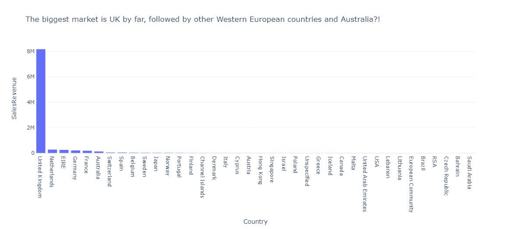
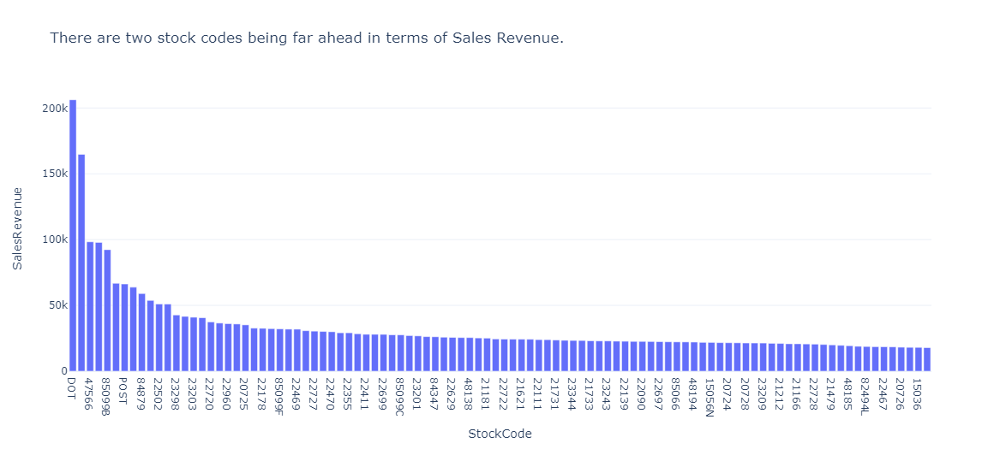
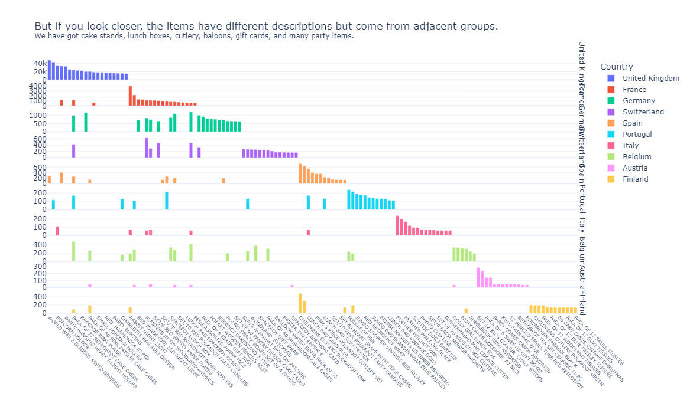
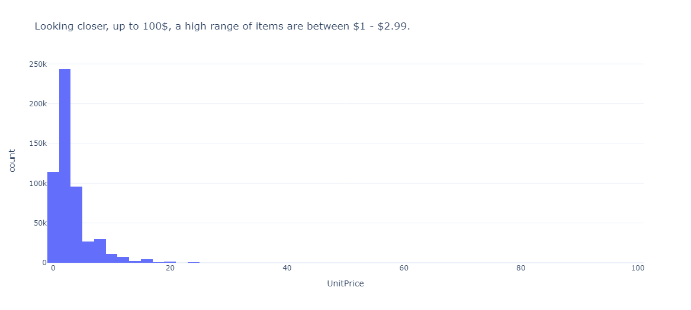
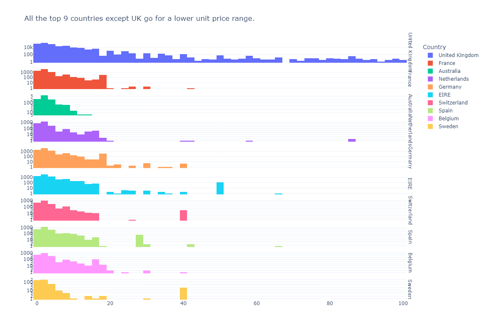

# E-Commerce Transaction Analysis
This project aims to understand the development of a UK-based e-commerce company throughout one year.

## Case Problem & Solution
The insights can help the company:
* Identify main market focus and adjust strategy.
* Understand if pricing optimization is needed.
* Improve data quality for better business development understanding.

## Data
This is a transnational data set which contains all the transactions occurring between 01/12/2010 and 09/12/2011 for a UK-based and registered non-store online retail.The company mainly sells unique all-occasion gifts. Many customers of the company are wholesalers.

## Limitations
**1. Limited time-frame**  
The data is only available for one year, which does not allow a cleaer understading of overall business development and seasonal effects.
**2. Missing data**
There are missing customer IDs, about 25%, and order descriptions.
**3. Unclear stock code convention**
Stock codes are not standardized, sometimes they are in digits, sometimes in letters. 

### Key Insights

## Future Considerations
1. Include more data (at least 2 years for comparison).
2. Standardize data across stock codes.
3. Include purchase dates along invoice dates to understand customer behavior across time.
4. Add categories (e.g. books, cutlery, software).
